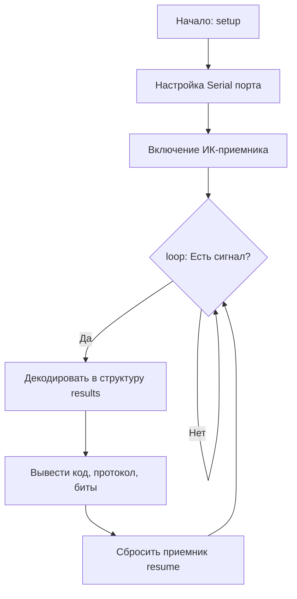

## 🔄 Алгоритм работы ИК-декодера

```mermaid
flowchart TD
    A[Начало: setup] --> B[Настройка Serial порта]
    B --> C[Включение ИК-приемника]
    C --> D{loop: Есть сигнал?}
    D -->|Нет| D
    D -->|Да| E[Декодировать в структуру results]
    E --> F[Вывести код, протокол, биты]
    F --> G[Сбросить приемник resume]
    G --> D
```
*Рисунок 1: Алгоритм работы скетча для считывания ИК-кодов*